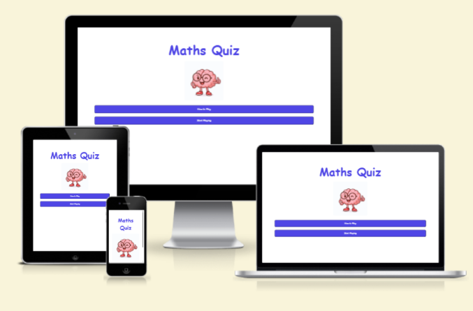
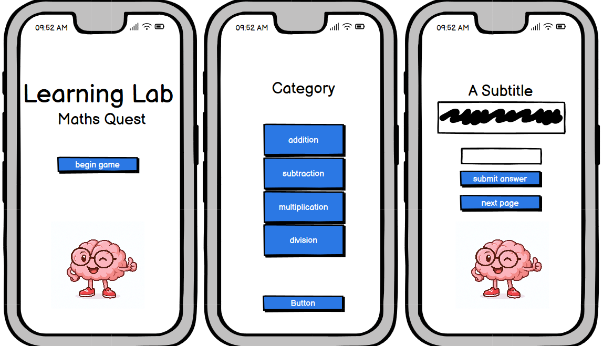
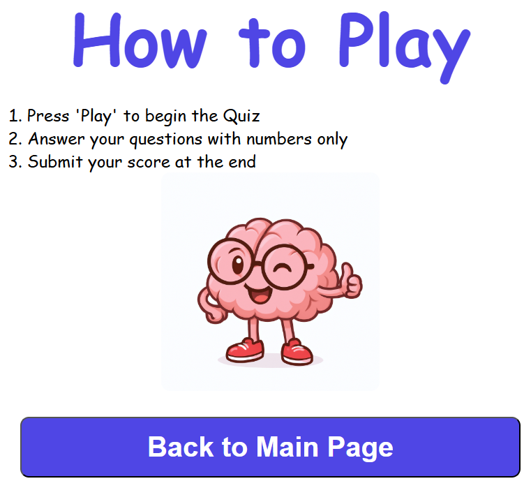

# maths-quest
# Table of Contents
- [Overview](#overview)
  - [Planning Stage](#planning-stage)
  - [Target Audiences](#target-audiences)
  - [User Stories](#user-stories)
  - [Site Aims](#site-aims)
  - [Design](#design)
    - [Wireframes](#wireframes)
    - [Colour Scheme & Typography](#colour-scheme--typography)
- [Features](#features)
- [Future Features](#future-features)
- [Technologies Used](#technologies-used)
- [Testing](#testing)
- [Deployment](#deployment)
- [Screenshots](#screenshots)
- [Known Faults](#known-faults)
- [Credits](#credits)
- [Acknowledgements](#acknowledgements)



## Overview
This interactive browser-based maths quiz is designed to help young learners practice random math questions. Learners will earn points and can submit their scores once the quiz is complete. The game is designed with a focus on education and engagement. This webpage can be used in both schools and home learning environments.
## Planning Stage
The planning stage involved defining the target audience, user experience, and design elements of the maths quiz. The goal was to create an engaging and educational experience for young learners,while also being accessible to parents, teachers, and individuals with additional needs.
("users with accessibility needs" is correct, but repetitive with “accessible” — variety improves flow.)
#### Target Audiences:
- Young learners in primary school years (ages 5-11).
- Parents and teachers looking for educational resources.
- Users with accessibility needs, including neurodiverse learners.
- Players who enjoy interactive and gamified learning experiences.
## User Experience
### User Stories
- As a young learner, I want to practice maths in a fun and challenging way.
- As a parent/teacher, I want an educational platform that focuses on maths skills.
- As a player, I want my progress to be seen by my teacher/parent.
- As a user with accessibility needs, I want the platform to be intuitive, accessible, and easy to navigate.
- As a neurodiverse learner, I want a learning platform that is engaging and not overwhelming or understimulating.
- As a young learner, I want to stay engaged and feel good about my learning experience.
- As a user, I want the platform to be responsive and work well on different devices.
#### Site Aims:
- To provide a fun and engaging way for young learners to practice maths skills.
- To create a platform that is accessible and easy to navigate for all users, including those with neurodiversity.
- To ensure the platform is responsive and works well on various devices, including desktops, tablets, and mobile phones.
- To provide a learning platform that supports teachers and parents in gaining insight into the progress of their young learner.
### Design
Wireframes for each section were created using Balsamiq. This process provided a basic but clear outline of how each section would look as well as arranging what layout worked best.
###  wireframes




The wireframes were to define the layout and structure of the math quiz platform. after consideration of various learning style and abilities it was best to scale back and simplify the design to ensure a more focused and effective learning experience. The final design includes a clean layout with clear navigation, interactive elements, and visual feedback to enhance user engagement.

## Colour Scheme
With Neurodiversity in mind alongside other accessibility needs, the colour scheme is designed to be calming and engaging, avoiding overly bright or harsh colours. The colours are chosen to provide a balance between stimulation and calmness, making it suitable for young learners.
| Element                | Color Code | Description |
|------------------------|------------|-------------|
|Page Background|	#ffffff|Soft white|
|Buttons|	#4f46e5	|Deep Indigo – strong primary color|
|Button Hover|	#6366f1	|Lighter Indigo – visual interaction|
|Accessibility features| #ff0026 | red - easily seen|

## Features
- The website presents randomly generated questions for addition, subtraction, multiplication, and division.
- The website provides positive feedback on answers and encouraging prompts to try again.
- When questions are answered correctly, scores are tracked and can be submitted to FormDump.
- The website is designed to be accessible, with keyboard navigation, alt text for images, and high-contrast visuals.
- The website has responsive design for desktop, tablet and mobile devices.

## Future Features
- Users can challenge other classmates or friends in real-time.
- Users would be able to set up a profile for tracking progress for parents and teachers.
- A countdown timer will be added to introduce a competitive element.
- Users will be able to select a difficulty level for each question.

## Technologies Used
I used the following technologies for this project:
- HTML5
- CSS
- JavaScript
- Git
- GitHub
- Visual Studio Code
- Chrome DevTools
- W3C Validator FOR HTML and CSS
- Lighthouse for performance testing
- Wave for accessibility testing
- Balsamiq for wireframing

### 🧪 User Stories Testing

| **User Story** | **Action/Test Performed** | **Actual Outcome** |
|----------------|---------------------------|---------------------|
| As a young learner, I want to practice maths in a fun and challenging way. | The quiz asks age appropriate questions randomly with no pressure to answer immediatey| Colour scheme is calm and playful. Game features (score, feedback, mascot) add engagement and fun. |
| As a parent/teacher, I want an educational platform that focuses on maths skills. | All questions are math-based and at asked in a random format | Each is an  age-appropriate math questions. No non-educational distractions present. |
| As a player, I want my progress to be seen by my teacher/parent. | A score summary is shown at the end and saved to localStorage. Results page includes user’s name and submission of scores | Scores are visible on the results page and can be submitted to FormDump.|
| As a user with accessibility needs, I want the platform to be accessible and easy to navigate. | Tested keyboard navigation, alt text for images, and high contrast visibility.| All key elements are accessible using keyboard. Layout is clear and readable.|
| As a neurodiverse learner, I want a learning platform that is engaging and not overwhelming or understimulating. | Limited to 10 questions | Questions are short, positive feedback is encouraging, and the layout avoids cognitive overload. |
| As a young learner, I want to stay engaged and feel good about my learning experience. | When question are answered you get instant answer for correct or incorrect | Users receive a mesage if answer is incorrect to encourage and teach them what is the correct answer|
| As a user, I want the platform to be responsive and work well on different devices. | Tested across Chrome, Firefox, and mobile (iOS/Android) using responsive design tools and physical devices. | Buttons stack correctly, layout adapts to screen size, and all interactive features work on mobile. |
| As a learner with additional needs I need to be able to navigate the webpage without using a keyboard| focus visible added to buttons and style with colours to stand out to users | when tab button pressed, it moves across the buttons, enter or space bar can be used to select what is highlighted and submit answers|


## 🧪 User Testing Feedback
| **Feedback** | **Suggested Change** | **Action Taken** |
|--------------|----------------------|------------------|
| Children wanted to see an overall score summary at the end. | Add a final results page that shows total correct answers. | Add a results page with a score summary |
| Some users pressed Enter after typing answers but didn’t realise they needed to click "Submit". | Create a clear "How to Play" or "Instructions" page to explain how to interact with the game. | A "How to Play" page has been implented into the page with clear instructions on how to play along with navigation buttons to begin playing|
| 




- Bugs were logged and fixed as part ofan ongoing testing process
- All fixes were tested manually on both desktop and mobile views
- Details of bugs are in the table below

# Validation
HTML


CSS


Lighthouse


WAVE


## Bug tracking and reporting.

The following bugs were also identified during user testing:

| **Bug** | **Action / Test Taken** | **Actual Outcome** |
|--------|--------------------------|--------------------|
| JavaScript not loading | Checked browser console – saw `404` error for `script.js`. Verified script path and corrected `<script src="...">`. | JavaScript loaded successfully; all game features (score, questions) worked. |
| No question displayed after "Get ready..." | Logged `mode` value with `console.log()` in `generateQuestion()`. Found `getPageType()` was returning `null`. | Renamed HTML files to include expected keywords (e.g., `addition`), fixing mode detection. |
| Form submission reloaded the page | Used `e.preventDefault()` and replaced form action with a `fetch()` POST to FormDump. | Page stayed loaded; results submitted in background. |
| Buttons not stacking on small screens | Added `.button-group` container and styled with `flex-direction: column`. | Buttons are stacked vertically on all screen sizes. |
| Mascot overlapping buttons on mobile | Positioned absolutely with no screen check. | Added media queries to move mascot to the centre and reduce size on small screens. |
| White space on large screens | Layout felt too sparse. Buttons and mascot were small. | Added responsive styles: larger buttons and mascot on wider screens, and `max-width` wrapper. |
| Questions display unrecognisable maths symbal for audience "/" "*"| change logic to display appropriate symbols using `displayOperator`| Questions now display recognisable symbols|


## Deployment

To deploy this page to GitHub Pages from its [GitHub repository](https://github.com/Tafari-K/maths-quiz), the following steps were taken: 

1. From the menu items near the top of the page, select **Settings**.
2. Scroll down to the **GitHub Pages** section.
3. Under **Source** click the drop-down menu labelled **None** and select **Main Branch**
4. On selecting Main Branch the page is automatically refreshed, the website is now deployed. 
5. Scroll back down to the **GitHub Pages** section to retrieve the link to the deployed website.
 

### How to run this project locally

To clone this project from GitHub:

1. Under the repository name, click "Clone or download".
2. In the Clone with HTTPs section, copy the clone URL for the repository. 
3. In your local IDE open Git Bash.
4. Change the current working directory to the location where you want the cloned directory to be made.
5. Type ```git clone```, and then paste the URL you copied in Step 3.
```console
git clone https://github.com/Tafari-K/maths-quiz.git
```
6. Press Enter. Your local clone will be created.

Further reading and troubleshooting on cloning a repository from GitHub [here](https://help.github.com/en/articles/cloning-a-repository).

# Screenshots


# Known faults

## Credits
# General reference:
- W3Schools for HTML, CSS, and JavaScript tutorials.
- Open AI for providing assistance with code and debugging.
- VS Code Copilot for code suggestions and improvements.
- GPT-4o for generating content and explanations.

# Media:
All images used in this project were sourced and altered from Freepik and its AI assistant, a website that provides free images and illustrations.
https://www.freepik.com/


Maths Quiz Mascot: Created using Freepik's AI assistant.
Original image: https://www.freepik.com/free-vector/8100-5-205_40675149.htm#fromView=search&page=1&position=20&uuid=ed50f3a8-123f-48cb-bb4a-b6ff73d6cc0d&query=brain+mascot