# maths-quest
# Table of Contents
- [Overview](#overview)
  - [Planning Stage](#planning-stage)
  - [Target Audiences](#target-audiences)
  - [User Stories](#user-stories)
  - [Site Aims](#site-aims)
  - [Design](#design)
    - [Wireframes](#wireframes)
    - [Colour Scheme & Typography](#colour-scheme--typography)
- [Features](#features)
- [Screenshots](#screenshots)
- [Future Features](#future-features)
- [Technologies Used](#technologies-used)
- [Testing](#testing)
  - [Responsiveness & Browser Testing](#responsiveness--browser-testing)
  - [User Stories Testing](#user-stories-testing)
  - [User Testing Feedback](#user-testing-feedback)
- [Deployment](#deployment)
- [Known Faults](#known-faults)
- [Credits](#credits)
- [Acknowledgements](#acknowledgements)


## Overview
This interactive browser-based maths quiz is designed to help young learners practice random math questions. Learners will earn points and can submit their scores once the quiz is complete. The game is designed with a focus on education and engagement. With understanding this maths quiz is aimed at learners, a lot of consideratinon has been taken into account when its comes to the design, learning styles and audience. The design layout encourages a learning style platform that suits the needs of accessibility navigation and basic to limited keyboard use.
The various styles are catered to alongside the targeted group of neurodiverse learners.This is addressed through simple and clean design elements, with clear typography, minimal distraction, and focus on the core aim of the quiz.
This webpage can be used in both schools and home learning environments.
## Planning Stage
The planning stage involved, defining the target audience, user experience, and design elements of the maths quiz. The goal was to create an engaging and educational experience for young learners, while also being accessible to parents, teachers, and individuals with additional needs. I research current well known educational brands to get an insight the best way to approach my deisgning, colour themes and overall planning of the quiz.
Leapfrog, edexcel, bbc bitesize were a few of the brands that have influenced my design choices.
#### Target Audiences:
- Young learners in primary school years (ages 5-11).
- Parents and teachers looking for educational resources.
- Users with accessibility needs, including
- Visual, kinesthetic, neurodiverse learners.
## User Experience
### User Stories
- As a young learner, I want to practice maths in a fun and challenging way.
- As a parent/teacher, I want an educational platform that focuses on maths skills.
- As a user with accessibility needs, I want a platform to be intuitive, accessible, and easy to navigate.
- As a neurodiverse learner, I want a learning platform that is engaging and not overwhelming or understimulating.
- As a young learner, I want to stay engaged and feel good about my learning experience.
- As a user, I want the platform to be responsive and work well on different devices.
#### Site Aims:
- To provide a fun and engaging way for young learners to practice maths skills.
- To create a platform that is accessible and easy to navigate for all users
- To embrace the various learning styles, including those with neurodiversity.
- To ensure the platform is responsive and works well on various devices, including desktops, tablets, and mobile phones.
- To provide a learning platform that supports teachers and parents in gaining insight into the progress of their young learners maths skills.
### Design
Wireframes for each section were created using Balsamiq.
With the consideration of what needed to be included within this quiz, the finally choices of layout,theme and overall presentation of the quiz very much achieves set goals explained in the Site Aim section.
With this process of building the through Balsamiq I was able to achieve visual presentation of the quiz and then developed the quiz to the outcome of what has been deployed.
###  wireframes
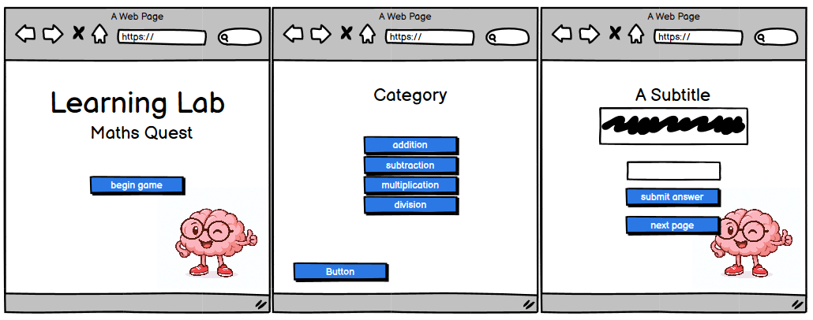


The wireframes were to define the layout and structure of the math quiz platform. after consideration of various learning style and abilities it was best to scale back and simplify the design to ensure a more focused and effective learning experience. The final design includes a clean layout with clear navigation, interactive elements, and visual feedback to enhance user engagement.

## Colour Scheme
With Neurodiversity in mind alongside other accessibility needs, the colour scheme is designed to be calming and engaging, avoiding overly bright or harsh colours. The colours are chosen to provide a balance between stimulation and calmness, making it suitable for learners within the neurodiverse community.
| Element                | Color Code | Description |
|------------------------|------------|-------------|
|Page Background|	#ffffff|Soft white|
|Buttons|	#4f46e5	|Deep Indigo – strong primary color|
|Button Hover|	#6366f1	|Lighter Indigo – visual interaction|
|Accessibility features| #ff0026 | red - easily seen|

## Features
- The website presents randomly generated questions for addition, subtraction, multiplication, and division.
- The website provides positive feedback quickly and corrects wrongly answered questions.
- During the quiz correct answer give the user 1 point which is stored in the local storage. And visual representation of the score is shown.
- The website is designed to be accessible, with keyboard navigation, with use of the tab key, enter button and space bar.
- Alt text for images, and high-contrast visuals.
- the website also has a instructions page to enhance user experience
- Text and buttons are in a large font for navigation.
- At the end of the quiz a summary of users score is shown
- Scores can be submitted to a Leaderboard.
- The website has responsive design for desktop, tablet and mobile devices.

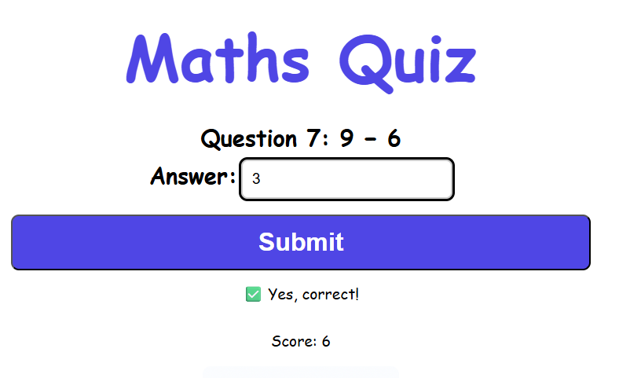


# Screenshots


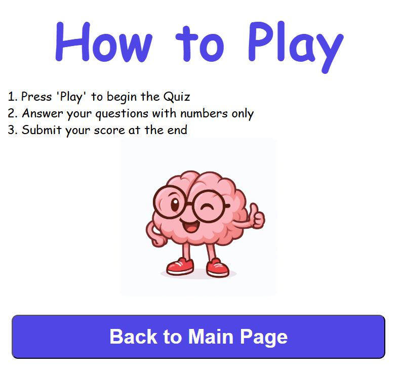

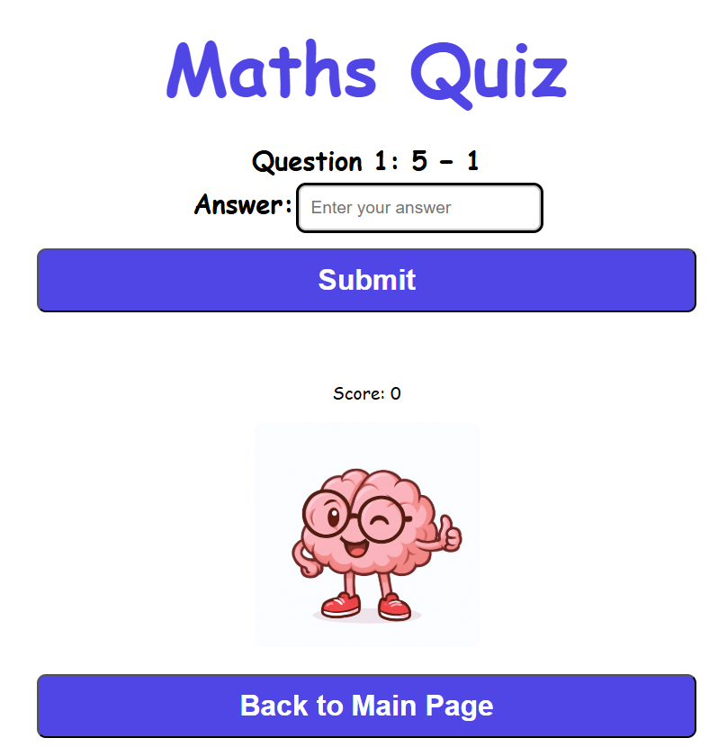
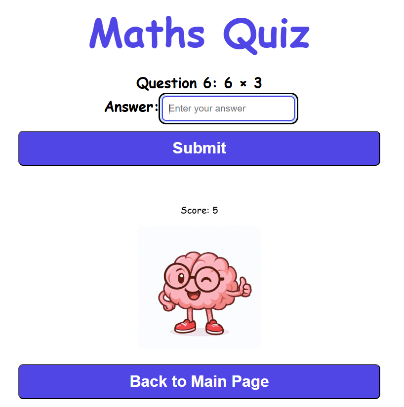
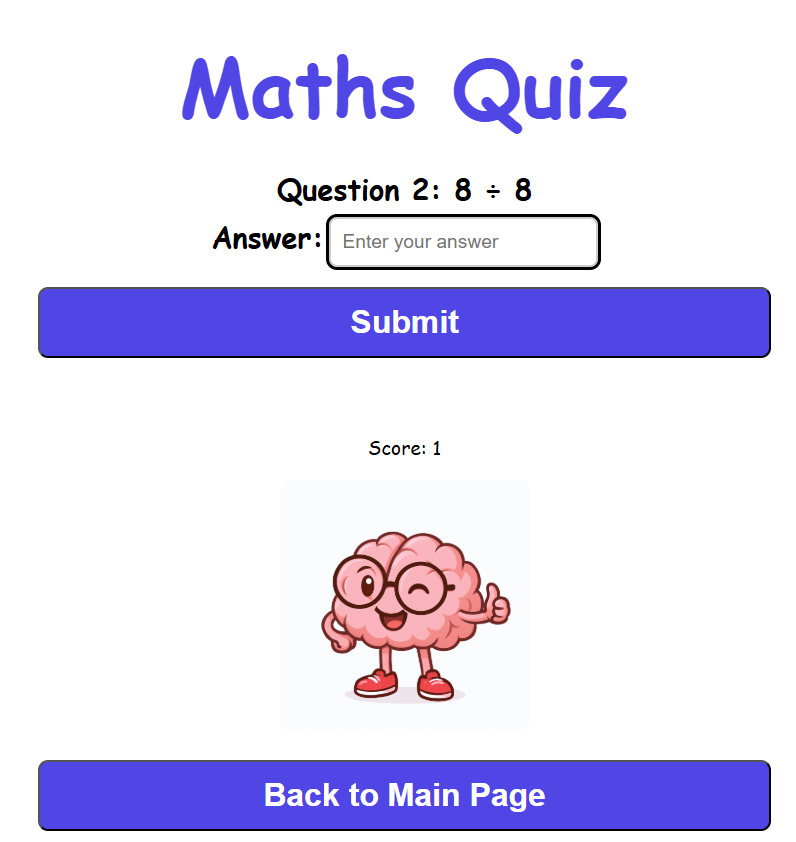
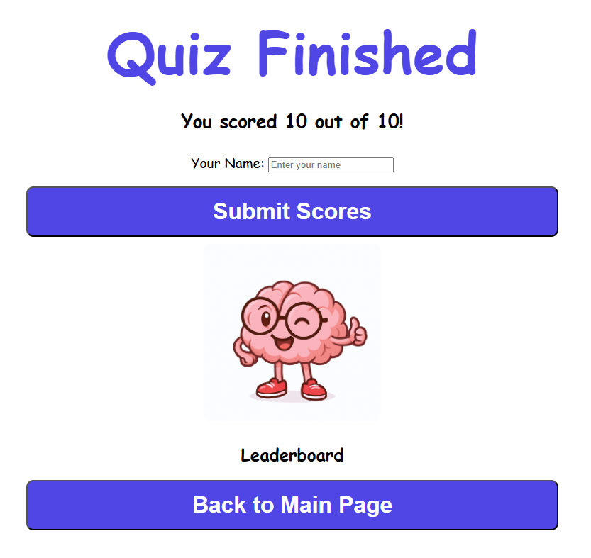
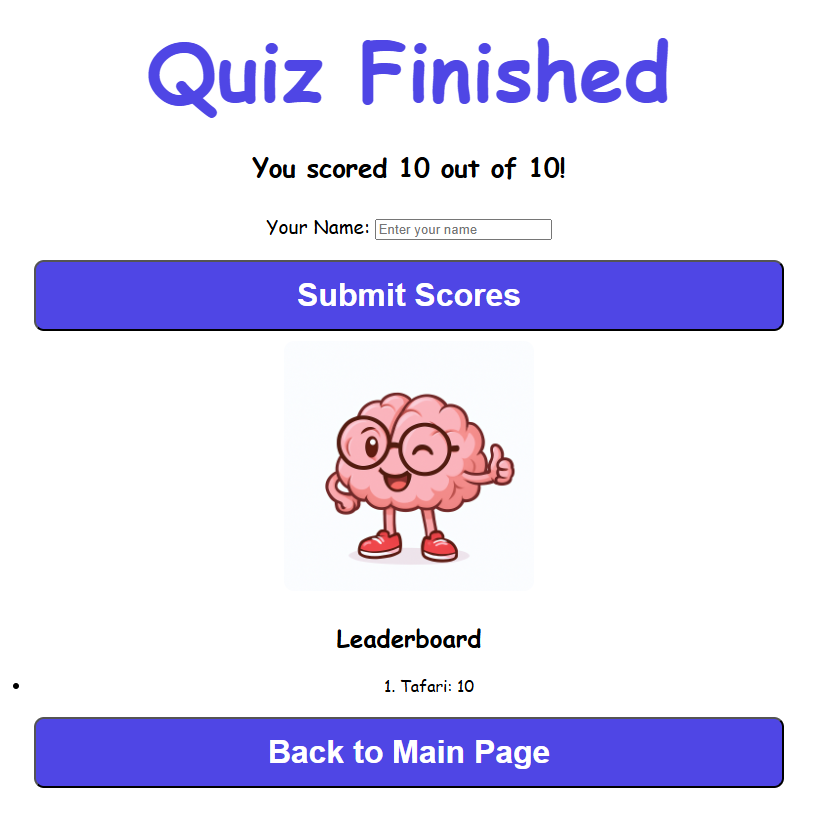
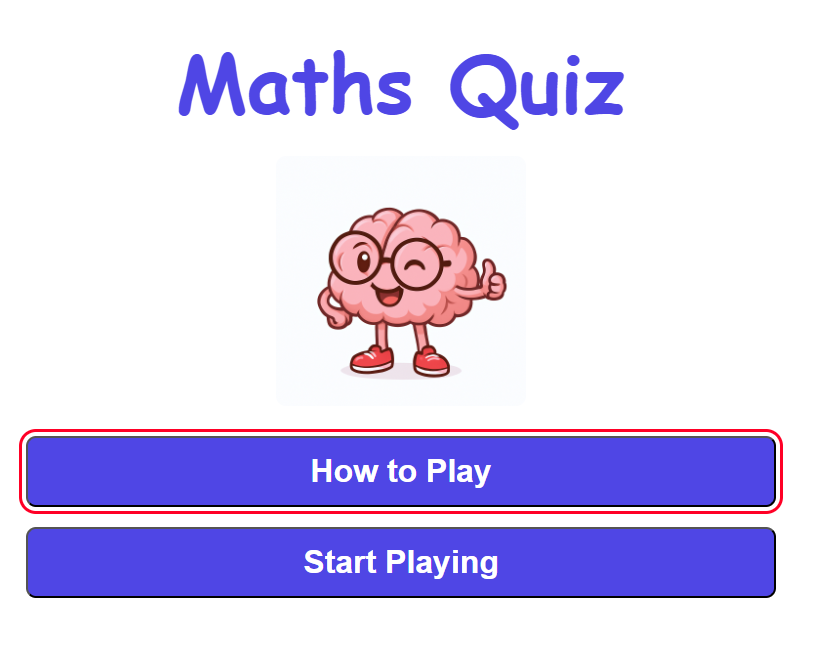

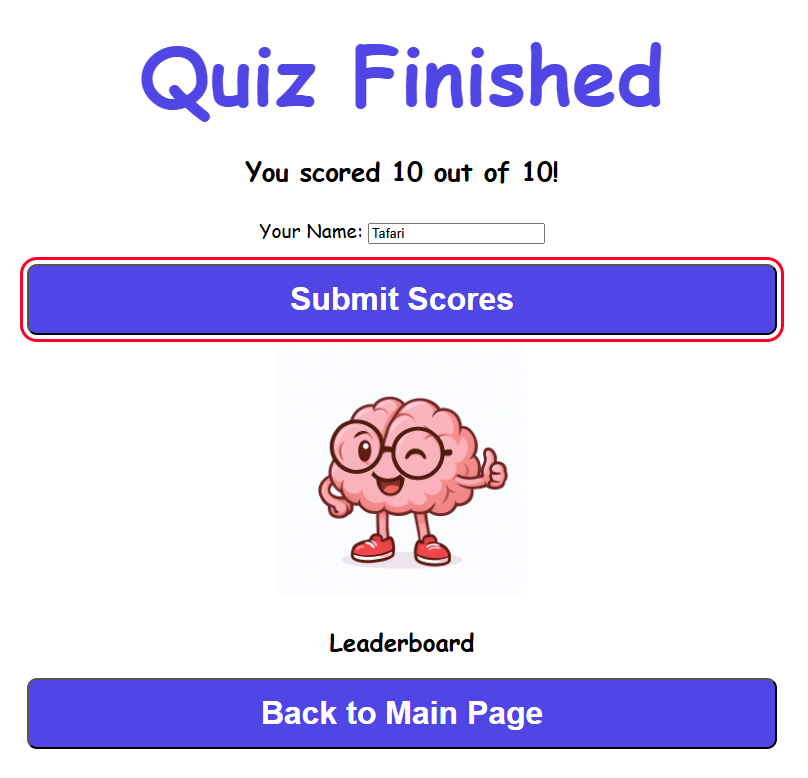

## Future Features
- Users can challenge other classmates or friends in real-time.
- Users would be able to set up a profile for tracking progress for parents and teachers.
- A countdown timer will be added to introduce a competitive element.
- Users will be able to select a difficulty level for each question.

## Technologies Used
I used the following technologies for this project:
- HTML5
- CSS
- JavaScript
- Git
- GitHub
- Visual Studio Code
- Chrome DevTools
- W3C Validator FOR HTML and CSS
- Jest Hint
- Lighthouse for performance testing
- Wave for accessibility testing
- Balsamiq

## Testing
The  website's responsiveness was tested outside of the browser by sending the deployed site to various devices and screen sizes.

### Responsiveness & Browser Testing

| Device / Screen Size  | Browser   | Page Tested   | Expected Behaviour                                     | Actual Behaviour                                      | Pass/Fail | Notes                           |
|------------------------|-----------|---------------|--------------------------------------------------------|-------------------------------------------------------|-----------|--------------------------------|
| iPhone SE (375×667)    | Safari    | Home          | Mascot above buttons, buttons stack vertically         | Works as expected                                     | ✅ Pass   | -                              |
| iPhone 12 (390×844)    | Safari    | Quiz Page     | Input field full width, no overlap with mascot         | Input slightly small                                  | ⚠ Partial| Adjusted input width in CSS    |
| iPad (768×1024)        | Chrome    | Results Page  | Score + leaderboard centered, no cut-off               | Works as expected                                     | ✅ Pass   | -                              |
| Desktop (1366×768)     | Chrome    | All Pages     | Full layout centered, no horizontal scroll             | Works as expected                                     | ✅ Pass   | -                              |
| Desktop (1920×1080)    | Firefox   | How to Play   | Content centered, mascot visible                       | Works as expected                                     | ✅ Pass   | -                              |
| Pixel 5 (393×851)      | Chrome    | Results Page  | Leaderboard centered, no bullets                       | Bullets appeared initially, fixed with CSS            | ✅ Pass   | Applied `list-style: none;`    |

### User Stories Testing

| **User Story** | **Action/Test Performed** | **Actual Outcome** |
|----------------|---------------------------|---------------------|
| As a young learner, I want to practice maths in a fun and challenging way. | Selected "start quiz" button. | quiz.js is executed and random questions are presented, with every new quiz played. |
| As a parent/teacher, I want an educational platform that focuses on maths skills. |Runthrough of quiz to check all question are acceptible math questions | Quiz asked age-appropriate math questions. No non-educational distractions present. |
| As a player, I want my progress to be seen by my teacher/parent. | Check socres summary is present at the end of quiz and name submittion present | Scores are visible on the results page results.js is executed. |
| As a user with accessibility needs, I want the platform to be accessible and easy to navigate. | Use tab,space and enter key to navigate site only | Focus styling visible.|
| As a neurodiverse learner, I want a learning platform that is engaging and not overwhelming or understimulating. | quiz.js Limits to 10 questions. Styled with high contrast colours | Questions are short, corrects given immediately, and the layout avoids cognitive overload. |
| As a young learner, I want to stay engaged and feel good about my learning experience. | Create a quiz.js that corrects questions and moves onto next question | Users receive a mesage if answer is incorrect to encourage and presents learner with the correct answer|
| As a user, I want the platform to be responsive and work well on different devices. | Once deployed use on multiple devices | Buttons stack correctly, layout adapts to screen size, and all interactive features work on mobile, tablet and desktop. |


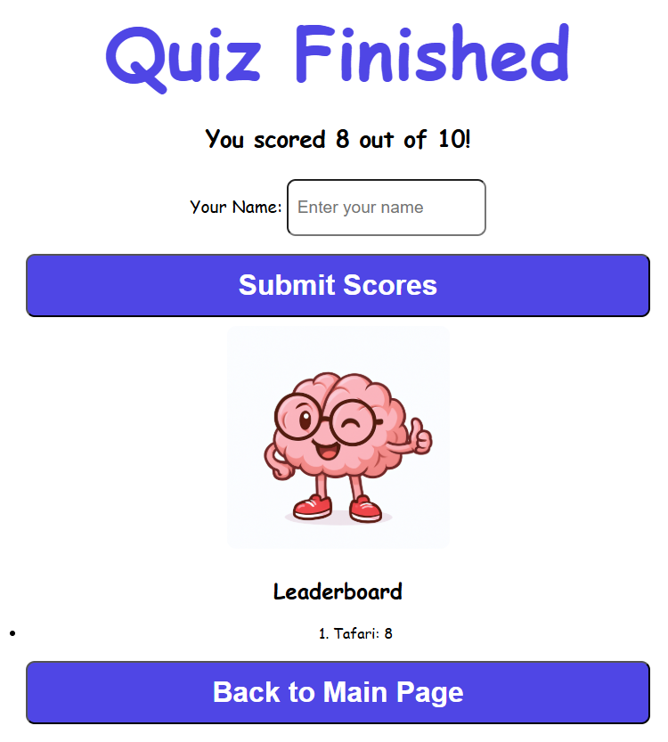


## User Testing Feedback
| **Feedback** | **Suggested Change** | **Action Taken** |
|--------------|----------------------|------------------|
| Children wanted to see an overall score summary at the end. | Add a final results page that shows total correct answers. | Add a results page with a score summary |
| Some users pressed Enter after typing answers but didn’t realise they needed to click "Submit". | Create a clear "How to Play" or "Instructions" page to explain how to interact with the game. | A "How to Play" page has been implented into the page with clear instructions on how to play along with navigation buttons to begin playing|
| 

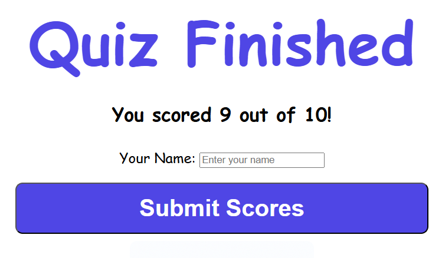


- Bugs were logged and fixed as part of an ongoing testing process
- All fixes were tested manually on both desktop and mobile views
- Details of bugs are in the table below

# Validation
HTML


CSS


Lighthouse


WAVE


JS Hint


## Bug tracking and reporting.

The following bugs were also identified during user testing:

| **Bug** | **Action / Test Taken** | **Actual Outcome** |
|--------|--------------------------|--------------------|
| JavaScript not loading | Checked browser console – saw `404` error for `script.js`. Verified script path and corrected `<script src="...">`. | JavaScript loaded successfully; all game features (score, questions) worked. |
| No question displayed after "Get ready..." | Logged `mode` value with `console.log()` in `generateQuestion()`. Found `getPageType()` was returning `null`. | Renamed HTML files to include expected keywords (e.g., `addition`), fixing mode detection. |
| Form submission reloaded the page | Used `e.preventDefault()` and replaced form action with a `fetch()` POST to FormDump. | Page stayed loaded; results submitted in background. |
| Buttons not stacking on small screens | Added `.button-group` container and styled with `flex-direction: column`. | Buttons are stacked vertically on all screen sizes. |
| Mascot overlapping buttons on mobile | Positioned absolutely with no screen check. | Added media queries to move mascot to the centre and reduce size on small screens. |
| White space on large screens | Layout felt too sparse. Buttons and mascot were small. | Added responsive styles: larger buttons and mascot on wider screens, and `max-width` wrapper. |
| Questions display unrecognisable maths symbal for audience "/" "*"| change logic to display appropriate symbols using `displayOperator`| Questions now display recognisable symbols|


## Deployment

To deploy this page to GitHub Pages from its [GitHub repository](https://github.com/Tafari-K/maths-quiz), the following steps were taken: 

1. From the menu items near the top of the page, select **Settings**.
2. Scroll down to the **GitHub Pages** section.
3. Under **Source** click the drop-down menu labelled **None** and select **Main Branch**
4. On selecting Main Branch the page is automatically refreshed, the website is now deployed. 
5. Scroll back down to the **GitHub Pages** section to retrieve the link to the deployed website.
 

### How to run this project locally

To clone this project from GitHub:

1. Under the repository name, click "Clone or download".
2. In the Clone with HTTPs section, copy the clone URL for the repository. 
3. In your local IDE open Git Bash.
4. Change the current working directory to the location where you want the cloned directory to be made.
5. Type ```git clone```, and then paste the URL you copied in Step 3.
```console
git clone https://github.com/Tafari-K/maths-quiz.git
```
6. Press Enter. Your local clone will be created.

Further reading and troubleshooting on cloning a repository from GitHub [here](https://help.github.com/en/articles/cloning-a-repository).


# Known faults

After thorough testing using browser developer tools, JavaScript console logs, HTML/CSS/JS validators and accessibility tools.Fault that are not addressed were not known once deployed.
## Credits
# General reference:
- W3Schools (HTML, CSS, and JavaScript)
- Open AI & GPT -4o (content, logic support)
- VS Code Copilot (code suggestions)

# Media:
All images were sourced and modified via Freepik 
https://www.freepik.com/


Maths Quiz Mascot: Created using Freepik's AI assistant.
Original image: https://www.freepik.com/free-vector/8100-5-205_40675149.htm#fromView=search&page=1&position=20&uuid=ed50f3a8-123f-48cb-bb4a-b6ff73d6cc0d&query=brain+mascot